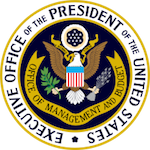

### Hi, **[I'm Pete](https://linkedin.com/in/petewaterman)** (he/him) and this is my official U.S. Government GitHub account!

---
# U.S. Digital Service, June 2019 to September 2022

* [Why I joined the U.S. Digital Service](https://medium.com/the-u-s-digital-service/why-we-serve-pete-waterman-24e2b72b3173)

**During my tour, I was credentialed at the following agencies and components:**

- [US Department of Homeland Security](https://www.dhs.gov/)
  - [Management Directorate](https://www.dhs.gov/management-directorate)
  - [Federal Emergency Management Agency](https://www.fema.gov/)
  - [US Citizenship and Immigration Services](https://www.uscis.gov/)
- [Executive Office of the President](https://www.whitehouse.gov/administration/executive-office-of-the-president/)
  - [Office of Management and Budget](https://www.whitehouse.gov/omb/)
- [US Department of Health and Human Services](https://www.hhs.gov/)
  - [Centers for Disease Control and Prevention](https://www.cdc.gov/)
  - [Administration for Children & Families](https://www.acf.hhs.gov/)

**I worked on projects with systems, software, and people at many more:**

- US Department of Homeland Security
   - Cybersecurity and Infrastructure Security Agency
  - Customs and Border Protection
  - Immigration and Customs Enforcement
- Consumer Financial Protection Bureau
- Environment Protection Agency
- Federal Communications Commission
- US Department of Labor
- US Department of State
- US Department of Agriculture
- US Department of Energy
- US Department of Interior
- US Department of Transportation
- US Department of Commerce
- General Services Administration
- Executive Office of the President
  - Various councils and components
